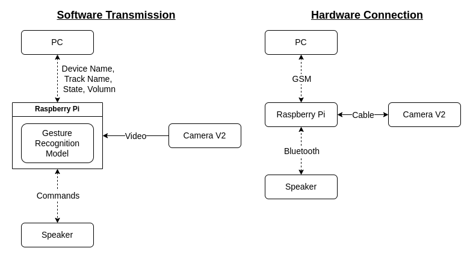
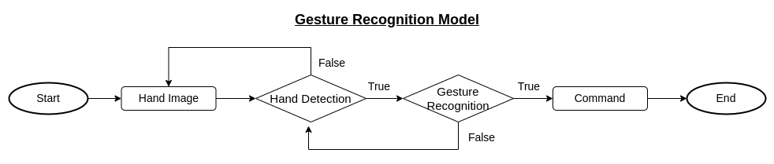

# Control Bluetooth Speaker by Gesture Recognition

# Mission Statements

### Bluetooth

Bluetooth technology is one of the most widely used wireless communication standards today, and can be found in many kinds of computer devices, mobile devices, and wearable devices. With the rise of Internet of Things(IoT) technology in recent years, low-power consumption and long-term operation have become the mainstream of wireless communication. Therefore, Bluetooth has also introduced a low-power standard in version 4.0, trying to cross over from the mobile device market to the IoT market.

### Gesture Rcognition

Gesture recognition is a technology that recognizes a specific gesture or movement in a person's hand and translates it into a command or operation that a computer can understand. The application of gesture recognition technology is becoming more and more widespread, and can be used in devices such as cell phones, tablets, smart watches, as well as in smart homes, in-car systems, and game control. In the future, gesture recognition technology is expected to become one of the most important means of human-computer interaction, and will continue to be improved and expanded.

# Challenges & Goals

- **Stage 1 : Recognize Hand Joints**
    > In this stage, the goal is to use a camera connected to a Raspberry Pi to recognize the different hand joints accurately. This can be achieved using computer vision techniques such as image segmentation, feature extraction, and pattern recognition. Once the hand joints are identified, their positions can be used as input for the subsequent stages.
    - Using camera to recognize hand joints correctly with Raspberry Pi.
    
- **Stage 2 : Recognize  Custom Gestures**
    > The aim of this stage is to develop a method to convert the information about the position and orientation of the hand joints into custom gestures. This could involve mapping certain hand positions or movements to specific commands, such as making a fist to pause or play music. Real-time images from the camera on the Raspberry Pi can be processed to recognize the custom gestures accurately.
    - Design a method to convert hand joint information into custom gestures.
    - Capture real-time images through the camera on the Raspberry Pi and correctly recognize gestures.
    
- **Stage 3 : Control Bluetooth Speaker with Custom Gestures**
    > In this stage, the goal is to establish stable Bluetooth communication between the Raspberry Pi and a Bluetooth speaker. Once the communication is established, the custom gestures recognized in stage 2 can be used to control the Bluetooth speaker, such as adjusting the volume, changing tracks, or changing the music on or off.
    - Stable Bluetooth communication with device.
    - Connect the Bluetooth speaker with the Bluetooth communication device on the Raspberry Pi and use the gesture information to control the Bluetooth speaker.
    
- **Stage 4 : Transmit/Receive Datas Between Raspberry Pi & PC**
    > The objective of this stage is to enable the Raspberry Pi to transmit and receive data with a PC using GSM communication. The data could include information about the Bluetooth speaker's status, such as the current volume or track, which could be uploaded to a cloud storage service like Google Drive. The PC can then download this information to display it in a graphical user interface, providing a user-friendly way to see the Bluetooth speaker status.
    - Via GSM to upload request datas to Google Drive, download datas into PC to display the information of device.


# Equipments

- **Hardware**
    - [Raspberry Pi 4 Computer Model B](https://www.raspberrypi.com/products/raspberry-pi-4-model-b/)
    - [HUAWEI E182E](https://www.4gltemall.com/huawei-e182e-3g-hspa-21mbps-wireless-usb-modem.html) (Modem Mobile Broadband Stick)
    - Bluetooth Speaker
    - Webcam
    - PC
- **Software**
    - [OpenCV](https://opencv.org/)
    - [Mediapipe](https://pypi.org/project/mediapipe/)
    - [VLC](https://pypi.org/project/python-vlc/)

# Flowcharts





# Procedures of execution of the project

1. **Implement Hand Detection**    
Mediapipe is a framework for building perception pipelines that process audio, video, and image data. We will use it to detect the 20 hand joints accurately, which will allow us to track the position and movement of each joint.
2. **Implement Gesture Recognition**   
We will design our own defined gestures, mapping each gesture to a specific command. The fingers will be used to represent different gesture, with different combinration representing different commands. 
    
    
    
    1. Volumn Up: Number1 (only index finger)
    2. Volumn Down: Number2 (index & middle finger)
    3. Next Song: Pointing Right (thumb & index finger)
    4. Previous Song: Pointing Left (thumb & index finger)
    5. Play Music: Hand Open
    6. Pause Music: Hand Close

3. **Develope code for Raspberry Pi to access Speaker state by bluetooth**    
We will use a Bluetooth communication device to connect the Raspberry Pi to the Bluetooth speaker. This will allow us to retrieve information about the state of the speaker, such as volume level and current track name.
4. **Develope Music Control Functions**   
We will use the gesture information to control the speaker functions, such as play, pause, skip, and volume control. These functions will be mapped to specific gestures, making it easy for the user to control the music playback without having to touch any buttons.
5. **Develope code for PC & Raspberry Pi communicate with GSM**   
We will use a GSM communication device, such as the "HUAWEI E182E," to transmit data between the Raspberry Pi and a Google Drive account. This will allow us to upload request data to Google Drive, download data into a PC, and display the information of the device.
6. **Integrate all functions**   
We will integrate all the functions developed in the previous steps into a single system. This will involve connecting the camera, Bluetooth speaker, and GSM communication device to the Raspberry Pi and developing the necessary software to enable the system to recognize gestures and control the speaker.

# Usage
Install required packages.  
```
pip install -r requirements.txt
```
Git Clone [Control Bluetooth Speaker by Gesture Recognition](https://github.com/nick8592/Control-Bluetooth-Speaker-by-Gesture-Recognition.git) Repository.  
```
cd <workspace_folder>
git clone https://github.com/nick8592/Control-Bluetooth-Speaker-by-Gesture-Recognition.git
```
Create new folder called `music`, and place in `workspace_folder/Control-Bluetooth-Speaker-by-Gesture-Recognition-main`
```
cd <workspace_folder>/Control-Bluetooth-Speaker-by-Gesture-Recognition-main
mkdir music
```
Place you own `xxx.mp3` files in `music` folder.  
Run `main.py`, then you can control music by using gestures.  
```
python main.py
```
> Note: For **Next**, **Previous**, **Pause**, you need to matain your position for **2 seconds** to trigger the actions.


# Tasks
 - [x] Implement Hand Detection
 - [x] Implement Gesture Recognition
 - [ ] ~~Develop code for Raspberry Pi to access Speaker state by bluetooth~~
 - [x] Develop Music Control Functions
 - [x] Integrate Gesture Recognition & Music Control Functions
 - [ ] Develop code for PC & Raspberry Pi communicate with GSM
 - [ ] Integrate all functions
 


# Conclusion

In summary, the overall goal of this project is to develop a system that can recognize hand gestures and use them to control a Bluetooth speaker. The project is divided into four stages, each with specific goals and tasks.

The first stage involves using a camera connected to a Raspberry Pi to accurately recognize hand joints. The second stage focuses on developing a method to convert the information about hand joints into custom gestures. In the third stage, the goal is to establish Bluetooth communication between the Raspberry Pi and a Bluetooth speaker and use the custom gestures to control the speaker. Finally, in the fourth stage, the Raspberry Pi is enabled to transmit and receive data with a PC using GSM communication, allowing the PC to display the status of the Bluetooth speaker.

This application has several potential benefits:

1. Accessibility: This application can help people with disabilities, such as those with limited mobility or those who are visually impaired, to control their Bluetooth speakers more easily using hand gestures.
2. Convenience: Using hand gestures to control a Bluetooth speaker can be more convenient than using traditional buttons or voice commands. Users can control the speaker from a distance or while their hands are occupied with other tasks.
3. Innovation: This project involves integrating several technologies, including computer vision, Bluetooth communication, and GSM communication, to create a unique and innovative system. It could inspire further research and development in these fields.

Overall, this project involves integrating computer vision techniques, Bluetooth communication, and GSM communication to create a system that can recognize hand gestures and use them to control a Bluetooth speaker. Furthermore, this projec has the potential to improve the user experience of controlling Bluetooth speakers, increase accessibility for people with disabilities, and inspire further innovation in technology.
